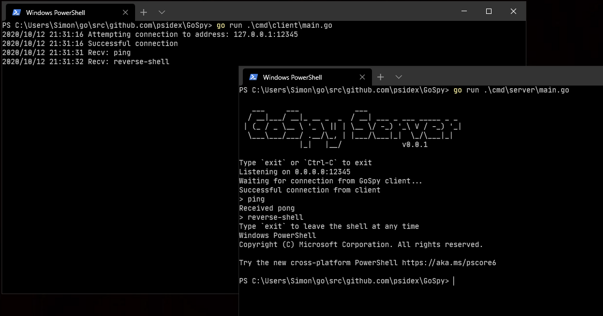

<h1 align="center">GoSpy</h1>

    
     
    
    
     
    
    
    

A cross-platform remote access tool

## Disclaimer

This project should be used for authorized testing or educational purposes only.

It is the final user's responsibility to obey all applicable local, state, and federal laws.

Authors assume no liability and are not responsible for any misuse or damage caused by this program.

## Usage

GoSpy consists of 2 binaries, the client is what you execute on your target machine and the server is what you run on
your machine to interact with the client.

## Features

These are almost all currently a WIP

- [x] Cross-platform with `CGO_ENABLED=0` (compiles to any target that Go supports)
- [x] Basic plaintext communication over TCP sockets
- [x] AES-256 encrypted communication over TCP sockets using a shared password
  - Note: Using an encrypted connection with this method will cause a noticeable increase in response times
- [x] Safe error handling so the client / server won't suddenly drop on error
- [x] Automatic reconnect for both client and server
- [x] Reverse shell
- [x] File grab
  - This is currently only supported using the current connection type (e.g. if using an encrypted connection the file
  will be encrypted for the transfer). This could cause a big slow down for large files, so I'm going to add the option
  to be able to choose plaintext transfer even if you're using an encrypted connection.
- [ ] File drop
- [ ] Screen grab
- [ ] Execute Lua scripts on target machine (using [gopher-lua](https://github.com/yuin/gopher-lua))
- [ ] More?

## Screenshot

## Why?

I wrote this project to learn more about both Go and penetration testing, as I recently completed an "Ethical Hacking"
unit for my university course and am interested in learning more.

## Architecture

The client maintains a main connection to the server, nicknamed `CmdCon`. This is only used to exchange commands and
arguments.

Any other time data needs to be transferred, a new connection is initiated (e.g. when sending a file). This means
that if anything goes wrong (e.g. a file read/write error) then the connection can just be closed instead of having
to deal with complicated communication logic (e.g. letting the client know an error ocurred when it's trying to send
file data). This also means that the user can decide if and when they want to use encryption (as using an encrypted
connection can be very slow).

This means that, for instance, the client can use the encrypted connection for interacting with a reverse shell, but if
they want to transfer a large file, it's much faster to exchange that over a "plaintext" connection.

## Credits

- [gopherize.me](https://gopherize.me/) for the icon
- [c-bata/go-prompt](https://github.com/c-bata/go-prompt/) for the interactive prompt on the server
- [JP Bruins Slot](https://itnext.io/encrypt-data-with-a-password-in-go-b5366384e291) for most of the encryption code
- [vfedoroff/go-netcat](https://github.com/vfedoroff/go-netcat/blob/master/main.go) for some reverse shell net logic
